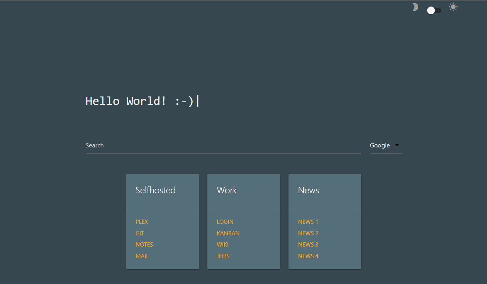
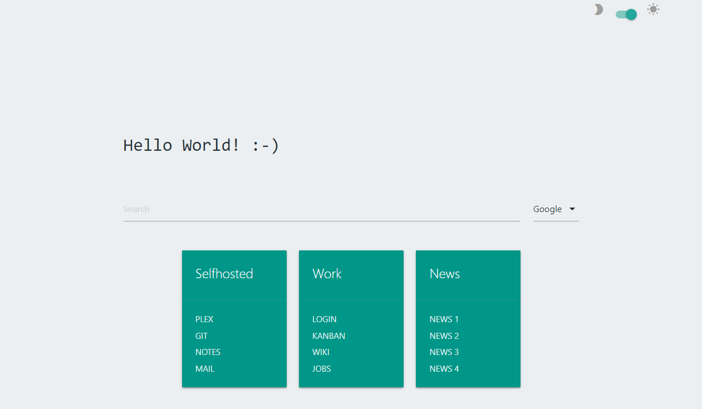

# Startpage / Dashboard
This repository contains the basic layout of my personal browser startpage. If you want to add your own bookmarks, edit the card-div's of the index.html. In the future I plan to use a static site generator for this task.

## Features
* Search bar with search engine selection
* Custom bookmark overview
* Dark and Light mode

## Frameworks
* MaterializeCSS
* TypeIt.js

## Screenshots
### Dark mode (default)

### Light mode

